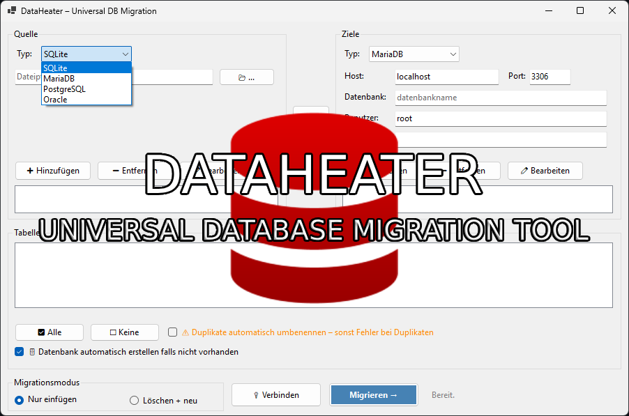

# DataHeater – Universal Database Migration Tool

**DataHeater** is a powerful Windows desktop tool for migrating data between multiple database systems.  
It supports **SQLite**, **MariaDB/MySQL**, **PostgreSQL**, and **Oracle** — in **both directions**.

<!--  -->



---

## Features

### Multi‑Source & Multi‑Target Migration
- Add **multiple source databases**
- Add **multiple target databases**
- Migrate tables from several sources into several targets in one run

### Oracle Support
- Oracle support is being integrated into the system
- UI and configuration already prepared
- Full Oracle migration support will be available soon

### Smart Table Handling
- Automatically loads tables from all selected sources
- Each table shows which source it belongs to
- Multi‑selection with Space‑key toggle
- Auto‑check on load

### Duplicate Detection & Auto‑Rename
- Detects tables with identical names across multiple sources
- Optional automatic renaming:  
  `TableName_from_<database>`

### Edit, Update & Manage Connections
- Add, remove, and edit source/target entries
- Cancel editing at any time
- UI updates instantly

### One‑Click Direction Swap
- Swap all sources ↔ targets with a single button
- Perfect for reverse migrations

### Automatic Database Creation
- For MariaDB, PostgreSQL, and Oracle
- Creates the target database automatically if it does not exist

### Parallel Multi‑Target Migration
- A selected table can be migrated into **all checked targets** simultaneously

### SQLite Export with Save Dialog
- When exporting to SQLite, a Save File dialog lets you choose the output file

---

## Supported Systems

| Database Type | Source | Target |
|---------------|--------|--------|
| SQLite        | ✔️     | ✔️     |
| MariaDB/MySQL | ✔️     | ✔️     |
| PostgreSQL    | ✔️     | ✔️     |
| Oracle        | ✔️     | ✔️     |

---

## Requirements

- Windows 10 or Windows 11  
- .NET 10 or later

---

## Installation

1. Download the latest `DataHeater.exe` from **Releases**
2. Run the EXE — no installation needed

---

## How to Use

### 1. Add Sources
- Choose database type
- SQLite → select file
- DB systems → enter Host, Port, Database, Username, Password
- Click **Add**

### 2. Add Targets
- Same process as sources
- SQLite targets use a Save File dialog

### 3. Connect
- Click **Connect**
- Tables from all checked sources are loaded
- Each table is automatically checked

### 4. Select Tables
- Check/uncheck manually
- Use **All** / **None** buttons
- Space toggles selected items

### 5. Choose Migration Mode
- **Insert only** — append data
- **Replace** — truncate + insert

### 6. Start Migration
- Click **Migrate →**
- Progress is shown live
- Each table is migrated into all checked targets

### 7. Swap Direction
- Click **⇄** to swap sources and targets

---

## Built With

- .NET 10 (Windows Forms)
- Microsoft.Data.Sqlite
- MySql.Data
- Npgsql
- Oracle Managed Data Access

---

## Build from Source

```bash
git clone https://github.com/pfurpass/DataHeater.git
cd DataHeater
dotnet publish -c Release -r win-x64 --self-contained true -p:PublishSingleFile=true
```

The final EXE will be located in:
```bash
bin\Release\net10.0\win-x64\publish\DataHeater.exe
```